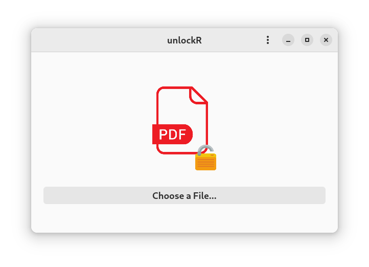

# unlockR




A simple tool to decrypt PDF files.

---

## Linux

<a href='https://flathub.org/apps/details/com.github.jkotra.unlockr'></a>

## Build

**Dependencies:**

```
GTK4
libadwaita
QPDF
```

`meson build -Dprefix=/usr`

`ninja install -C build`

### Flatpak


to build from local directory, use:
```
flatpak-builder --user --install build-dir dist/flatpak/com.github.jkotra.unlockr.yml --force-clean
```

---

## Windows

### Install dependencies


```
pacman -S mingw-w64-x86_64-gcc mingw-w64-x86_64-gtk4 mingw-w64-x86_64-libadwaita mingw-w64-x86_64-qpdf mingw-w64-x86_64-pkg-config
```

```
./run_program_debug.ps1
```

to import dll dependencies, run in `msys2.exe`:

`ldd unlockr.exe | grep '\/mingw.*\.dll' -o | xargs -I{} cp "{}" .`


* Or, run `windows_portable.py`

# License

unlockR is licensed under [GPLv3](LICENSE).